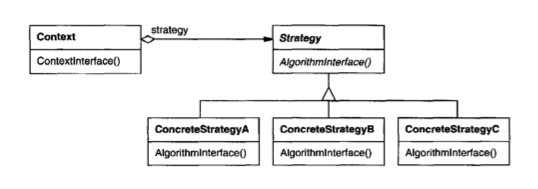

# Strategy (a.k.a. "policy") design pattern (behavioral)

Enables **selecting an algorithm** at runtime.

For this example, imagine that you are a Google Maps employee working on the calculation of `Routes`. The user can select many different `TransportTypes`, for example car, bike, or motorcycle. Your task is to calculate the best path to the given `TransportType` and GPS coordinates but, to achieve this goal, you will need to develop an algorithm for each of the available `TransportTypes`.

## UML diagrams

##### Diagram 1

  

##### Diagram 2

